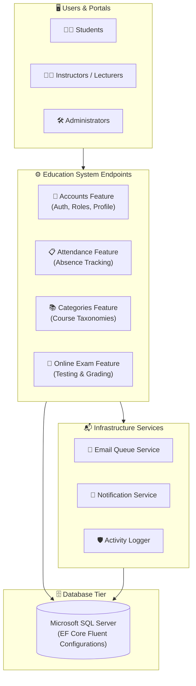

<div align="center">

# 🎓 Education System
### Modular Online Examination, Attendance & Student Lifecycle Management Platform

[](https://dotnet.microsoft.com/)
[](https://learn.microsoft.com/en-us/dotnet/csharp/)
[](#-system-architecture)
[](LICENSE)
[](https://github.com/OmarAlfar0uk)

<p align="center">
  <a href="#-key-features">Key Features</a> •
  <a href="#-system-architecture">System Architecture</a> •
  <a href="#-domain-model">Domain Model</a> •
  <a href="#-tech-stack">Tech Stack</a> •
  <a href="#-getting-started">Getting Started</a> •
  <a href="#-author">Author</a>
</p>

</div>

---

## 📌 Executive Overview

**Education System** is a robust academic administration and online testing engine designed to streamline modern institutional operations. It combines fine-grained **Attendance Tracking**, an **Audit/Activity Logging** infrastructure, categorized question banks, and an asynchronous **Email Queueing Service** to provide an enterprise-grade digital classroom experience.

> [!NOTE]
> Designed using **Feature Slices with Minimal Endpoints**, **Entity Type Configurations** via EF Core Fluent API, and **Domain Abstractions** (`IEmailQueueService`, `INotificationService`, `ICurrentUserService`).

---

## ✨ Key Features

| ⚡ Feature | 💡 Description | 🛠 Engineering Detail |
|---|---|---|
| **📝 Online Exam Engine** | Configurable online exams with question categorization | Category-driven question distribution and automated evaluation |
| **📋 Attendance Monitoring** | Daily course attendance records and student ratios | Entity-mapped configurations with presence/absence auditing |
| **🛡️ Activity & Audit Logs** | Comprehensive tracking of user operations | `ActivityLogConfiguration` auditing administrative and exam events |
| **📨 Asynchronous Email Queue** | Background email queueing to prevent thread blocking | `IEmailQueueService` decoupling email dispatch from web requests |
| **🔐 Role-Based Access** | Secure user lifecycle for Students, Lecturers, and Admins | Custom `ApplicationUser` entity extending ASP.NET Core Identity |

---

## 🏛 System Architecture



---

## ⚡ Tech Stack

| Category | Technology | Purpose |
|---|---|---|
| **Platform** |   | Primary backend application runtime |
| **Architecture** |   | Clean domain abstractions and endpoint dispatching |
| **Database & ORM** |   | Fluent API entity configurations and migrations |
| **Queuing & Mail** |  | Background email queuing and notification engine |

---

## 🚀 Getting Started

### Prerequisites
- [.NET 8.0 SDK](https://dotnet.microsoft.com/download/dotnet/8.0)
- SQL Server (LocalDB or Docker instance)

### Setup Instructions

1. **Clone the repository:**
   ```bash
   git clone https://github.com/OmarAlfar0uk/education-system.git
   cd education-system
   ```

2. **Configure Settings:**
   Configure connection string in `appsettings.json`:
   ```json
   {
     "ConnectionStrings": {
       "DefaultConnection": "Server=localhost;Database=EducationSystemDb;Trusted_Connection=True;TrustServerCertificate=True;"
     }
   }
   ```

3. **Update Database & Launch:**
   ```bash
   dotnet ef database update
   dotnet run
   ```

---

## 👨‍💻 Author

**Omar Alfarouk**  
*Full-Stack .NET & Software Engineer*  

- 🌐 **GitHub:** [@OmarAlfar0uk](https://github.com/OmarAlfar0uk)
- 💼 **LinkedIn:** [omar-alfarouk](https://www.linkedin.com/in/omar-alfarouk-252471251/)
- 📧 **Email:** [omaralfarouk646@gmail.com](mailto:omaralfarouk646@gmail.com)

---

<div align="center">
  <sub>Built with ❤️ by Omar Alfarouk. Licensed under the <a href="LICENSE">MIT License</a>.</sub>
</div>
