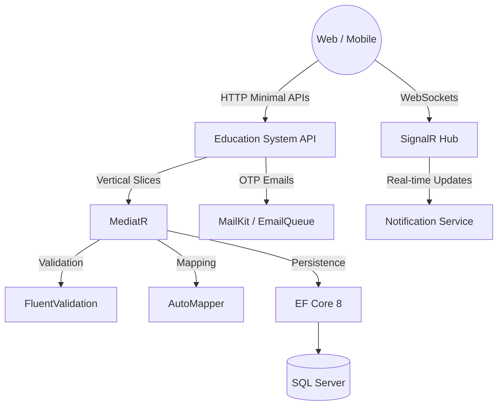

# 🏫 education-system

[](https://dotnet.microsoft.com/)
[]()
[](https://docs.microsoft.com/en-us/ef/core/)
[](https://www.microsoft.com/en-us/sql-server)

**education-system** is a modern, monolithic education management backend architected using Vertical Slice Architecture and Minimal APIs. It features robust real-time notifications via SignalR, comprehensive exam and attendance tracking, and highly secure OTP-based email verification workflows.

## 🏗️ Architecture & Flow



## ✨ Features

| Feature | Description |
|---------|-------------|
| **Vertical Slice Architecture** | Features are organized by domain slices rather than technical layers using Minimal APIs. |
| **Real-Time Notifications** | SignalR integration for instant delivery of system notifications to clients. |
| **Advanced Authentication** | Login, registration, password resets, and OTP-based email confirmation. |
| **Exam Management** | Full lifecycle for Exams, Questions, Choices, User Answers, and Exam Attempts. |
| **Attendance & Enrollment** | Mark and update student attendance; manage course enrollments. |
| **Parent & Student Portals** | Dedicated domain models linking Parents to Students for progress tracking. |
| **Rich Email Templates** | HTML-based email templates (e.g., Welcome emails) sent via MailKit. |
| **CI/CD Ready** | Integrated GitHub Actions workflows for continuous integration. |

## 🛠️ Tech Stack

| Category | Technology |
|----------|------------|
| **Framework** | .NET 8.0, ASP.NET Core Minimal APIs |
| **Architecture** | Vertical Slice Architecture |
| **Real-Time Comm.**| ASP.NET Core SignalR |
| **Data Access** | Entity Framework Core 8, SQL Server |
| **Libraries** | MediatR 11, AutoMapper 15, FluentValidation 12, MailKit |
| **DevOps** | GitHub Actions |

## 📂 Project Structure

```text
education-system/
├── .github/             # GitHub Actions CI/CD workflows
├── Endpoints/           # Minimal API endpoint definitions
├── Features/            # Vertical slices (Accounts, Attendance, Exams, etc.)
├── Entities/            # Domain Models (ApplicationUser, Exam, Grade, etc.)
├── Templates/           # HTML Email templates
├── Hubs/                # SignalR Hubs for real-time notifications
└── Program.cs           # Application configuration
```

## 🚀 Getting Started

To get the project up and running locally, execute the following commands:

```bash
git clone https://github.com/OmarAlfar0uk/education-system.git
cd education-system
dotnet restore
dotnet run
```

---
**Author**  
GitHub: [OmarAlfar0uk](https://github.com/OmarAlfar0uk) | LinkedIn: [omar-alfarouk-252471251](https://www.linkedin.com/in/omar-alfarouk-252471251/) | Email: [omaralfarouk646@gmail.com](mailto:omaralfarouk646@gmail.com)
